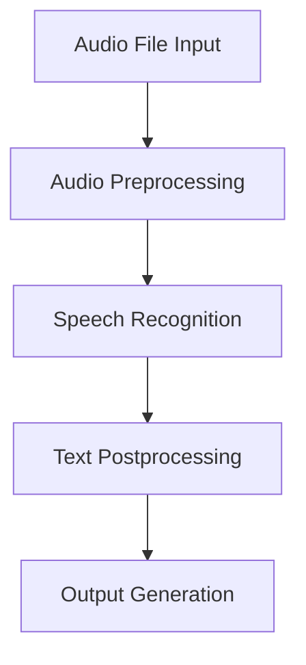

# Dataflow & Workflow: Audio-to-Text Prescription

## Dataflow
1. **Audio Input**: The process begins with an audio file (e.g., WAV, MP3) containing a spoken prescription.
2. **Audio Preprocessing**: The audio file is loaded and, if necessary, preprocessed (e.g., noise reduction, format conversion).
3. **Speech Recognition**: The preprocessed audio is passed to a speech recognition engine (such as Google Speech Recognition via the `speech_recognition` library), which converts the spoken words into raw text.
4. **Text Postprocessing**: The raw text may be cleaned, formatted, or parsed to extract structured prescription information (e.g., patient name, medication, dosage).
5. **Output Generation**: The final structured text is outputted, either to the console, a text file, or another system for further use.

## Workflow

### Step-by-Step Workflow
1. **User provides an audio file** containing the prescription.
2. **Script loads and preprocesses** the audio file for optimal recognition.
3. **Speech recognition engine** transcribes the audio to text.
4. **Text is postprocessed** to extract and format prescription details.
5. **Structured prescription text** is saved or displayed for further use.

---

This workflow ensures a smooth transition from spoken prescriptions to digital, structured text, facilitating easier record-keeping and integration with healthcare systems. 