# 🔄 Technical Data Flow & Workflow Documentation

## 📋 Overview

This document provides a comprehensive technical analysis of the **Audio-to-Text Medical Prescription Generator** data flow and workflow. It serves as a detailed companion to the [README.md](README.md) documentation, focusing on the technical implementation, data transformations, API interactions, and system architecture.

> **Cross-Reference**: For user-friendly setup and usage instructions, see the main [README.md](README.md) documentation.

## 🏗️ System Architecture

The application follows a **sequential processing pipeline** that transforms real-time audio input into structured medical prescriptions through multiple stages of data processing and AI analysis.

### Core Components

```mermaid
graph TB
    subgraph "Local Environment"
        A[👤 User Interface<br/>Python CLI] --> B[🎤 Audio Recording<br/>SoundDevice Library]
        B --> C[📁 File Management<br/>WAV File Creation]
    end
    
    subgraph "External APIs"
        D[🌐 AssemblyAI API<br/>Speech-to-Text Service]
        E[🤖 Google Gemini AI<br/>Prescription Generation]
    end
    
    subgraph "Data Processing"
        F[📝 Text Processing<br/>Transcription Handling]
        G[📋 Prescription Formatting<br/>Medical Structure]
    end
    
    C --> D
    D --> F
    F --> E
    E --> G
    G --> A
    
    style A fill:#e8f5e8
    style B fill:#f3e5f5
    style C fill:#fff3e0
    style D fill:#e3f2fd
    style E fill:#fce4ec
    style F fill:#f1f8e9
    style G fill:#e8f5e8
```



## 🔄 Detailed Data Flow Analysis

### Phase 1: Audio Capture & Processing

#### 1.1 Real-Time Audio Recording
- **Function**: [`manual_record_audio()`](prescription.py:58)
- **Technology**: SoundDevice library with NumPy array processing
- **Audio Specifications**:
  - **Sample Rate**: 22,050 Hz (optimized for speech recognition)
  - **Channels**: 1 (mono recording)
  - **Bit Depth**: 16-bit (converted from float64)
  - **Format**: WAV (uncompressed)
  - **File**: [`user_input.wav`](prescription.py:58) (temporary)

#### 1.2 Audio Data Transformation
```python
# Data flow within audio recording
Float64 Audio Stream → NumPy Array → Int16 Conversion → WAV File
```

**Technical Implementation**:
1. **Stream Capture**: Continuous audio input via callback function
2. **Buffer Management**: Audio chunks stored in Python list
3. **Array Concatenation**: Multiple chunks combined using [`np.concatenate()`](prescription.py:75)
4. **Format Conversion**: Float64 → Int16 using [`np.int16(audio * 32767)`](prescription.py:76)
5. **File Writing**: WAV file creation using [`scipy.io.wavfile.write()`](prescription.py:77)

### Phase 2: Speech-to-Text Transcription

#### 2.1 AssemblyAI API Integration
- **Function**: [`transcribe_audio()`](prescription.py:20)
- **API Endpoint**: `https://api.assemblyai.com`
- **Authentication**: Bearer token in headers ([line 17](prescription.py:17))

#### 2.2 Multi-Step API Workflow


#### 2.3 Data Transformation Details

**Step 1: File Upload**
- **Input**: Binary WAV file (22kHz, mono, 16-bit)
- **Output**: Cloud storage URL
- **API Call**: `POST /v2/upload`

**Step 2: Transcription Request**
- **Input**: Audio URL + configuration
- **Configuration**: 
  ```json
  {
    "audio_url": "https://cdn.assemblyai.com/upload/...",
    "language_detection": true
  }
  ```
- **Output**: Transcription job ID

**Step 3: Result Polling**
- **Method**: Synchronous polling with 3-second intervals
- **Status Tracking**: `queued` → `processing` → `completed`/`error`
- **Output**: Transcribed text string

### Phase 3: AI-Powered Prescription Generation

#### 3.1 Google Gemini AI Integration
- **Function**: [`prescription()`](prescription.py:81)
- **Model**: `gemini-1.5-flash`
- **API Key**: Environment variable [`GEMINI_API_KEY`](.env:1)

#### 3.2 Prompt Engineering & Context Processing

**Structured Prompt Template**:
```python
prompt = f'''
You are a doctor. The following is a recorded conversation between you and a patient 
during a medical consultation and the visit time is {formatted}.
Based on this conversation, write a clear, detailed, and medically accurate prescription...

Ensure the prescription includes:
- Patient complaints/symptoms
- Clinical observations (if mentioned)
- Diagnosis (if implied or stated)
- Medications (with dosage and duration)
- Any tests or investigations advised
- Lifestyle or dietary recommendations (if any)
- Follow-up instructions
'''
```

#### 3.3 Data Processing Pipeline

```mermaid
flowchart LR
    A[📝 Raw Transcription] --> B[🔍 Context Analysis]
    B --> C[🏥 Medical Interpretation]
    C --> D[📋 Structured Prescription]
    
    subgraph "Gemini AI Processing"
        B
        C
    end
    
    style A fill:#f1f8e9
    style B fill:#e3f2fd
    style C fill:#fce4ec
    style D fill:#e8f5e8
```



## 🔒 Security & Data Privacy Considerations

### 3.1 API Key Management
- **AssemblyAI Key**: Currently hardcoded ([line 17](prescription.py:17)) ⚠️ **SECURITY RISK**
- **Gemini Key**: Stored in [`.env`](.env) file ✅ **Better Practice**
- **Recommendation**: Move all keys to environment variables

### 3.2 Data Handling Security

**Temporary File Management**:
- **Creation**: [`user_input.wav`](prescription.py:58) created during recording
- **Deletion**: Automatically removed after transcription ([line 49](prescription.py:49))
- **Lifetime**: Exists only during processing cycle

**Data Transmission Security**:
- **AssemblyAI**: HTTPS encrypted upload and API calls
- **Google Gemini**: HTTPS encrypted API communication
- **Local Storage**: Minimal temporary file exposure

### 3.3 Privacy Considerations

**Medical Data Handling**:
- **Audio**: Temporarily stored locally, then uploaded to AssemblyAI
- **Transcription**: Processed by third-party services
- **Prescription**: Generated by Google AI
- **Compliance**: Consider HIPAA/GDPR requirements for medical data

## ⚠️ Error Handling & Edge Cases

### 4.1 Audio Recording Errors

**Common Scenarios**:
- **Microphone Access Denied**: System permission issues
- **No Audio Input**: Silent recording or microphone failure
- **Audio Quality Issues**: Background noise, low volume

**Error Detection**:
```python
# Implemented in callback function
def callback(indata, frames, time, status):
    if status:
        print(status)  # Audio system errors
```

### 4.2 Transcription Failures

**API Error Handling**:
```python
if result['status'] == 'error':
    raise RuntimeError(f"Transcription failed: {result['error']}")
```

**Common Failure Modes**:
- **Network Connectivity**: Internet connection issues
- **API Rate Limits**: Exceeded usage quotas
- **Audio Format Issues**: Unsupported file formats
- **Language Detection Failures**: Unclear or mixed languages

### 4.3 AI Generation Errors

**Error Detection Logic**:
```python
if "Google API error" in text or "Could not understand audio." in text:
    return "Sorry Doc, I can't help you today."
```

**Potential Issues**:
- **API Key Invalid**: Expired or incorrect Gemini key
- **Content Policy**: Medical content restrictions
- **Context Insufficient**: Unclear conversation for prescription generation

## 📊 Performance & Technical Specifications

### 5.1 Audio Processing Performance

**Recording Specifications**:
- **Latency**: Real-time recording with minimal delay
- **Memory Usage**: Streaming buffer management
- **File Size**: ~1.3MB per minute (22kHz, 16-bit, mono)

### 5.2 API Response Times

**Typical Processing Times**:
- **File Upload**: 2-5 seconds (depends on file size)
- **Transcription**: 10-30 seconds (depends on audio length)
- **AI Generation**: 5-15 seconds (depends on complexity)
- **Total Workflow**: 20-50 seconds average

### 5.3 Language Support

**AssemblyAI Language Detection**:
- **Auto-Detection**: Enabled via `language_detection: true`
- **Supported Languages**: 50+ languages including:
  - English, Spanish, French, German, Italian, Portuguese
  - Hindi, Arabic, Chinese, Japanese, Korean
  - And many more regional languages

## 🔧 Implementation Details

### 6.1 Dependencies & Libraries

**Core Libraries**:
- [`sounddevice`](requirements.txt:4): Real-time audio I/O
- [`numpy`](requirements.txt:5): Numerical array processing
- [`scipy`](requirements.txt:6): Scientific computing (WAV file operations)
- [`requests`](prescription.py:9): HTTP API communications
- [`google-generativeai`](requirements.txt:2): Gemini AI integration
- [`python-dotenv`](requirements.txt:3): Environment variable management

### 6.2 File System Operations

**Temporary File Lifecycle**:
1. **Creation**: WAV file created during recording
2. **Usage**: File uploaded to AssemblyAI
3. **Cleanup**: File deleted after successful transcription
4. **Error Handling**: File may persist if process fails

### 6.3 Configuration Management

**Environment Variables**:
```bash
# .env file structure
GEMINI_API_KEY="your_gemini_api_key_here"
```

**Hardcoded Configuration**:
- AssemblyAI API key ([line 17](prescription.py:17))
- Base URL and endpoints
- Audio parameters (sample rate, channels)

## 🔄 Workflow State Machine


## 📈 Data Flow Metrics

### 7.1 Data Transformation Stages

| Stage | Input Format | Output Format | Processing Time | Data Size |
|-------|-------------|---------------|-----------------|-----------|
| Recording | Audio Stream | WAV File | Real-time | ~1.3MB/min |
| Upload | WAV File | Cloud URL | 2-5 sec | Same |
| Transcription | Audio URL | Text String | 10-30 sec | ~1KB |
| AI Generation | Text + Prompt | Prescription | 5-15 sec | ~2-5KB |

### 7.2 API Interaction Summary

**AssemblyAI API Calls**:
1. `POST /v2/upload` - File upload
2. `POST /v2/transcript` - Transcription request
3. `GET /v2/transcript/{id}` - Status polling (multiple calls)

**Google Gemini API Calls**:
1. `POST /v1/models/gemini-1.5-flash:generateContent` - Prescription generation

## 🔗 Cross-References & Related Documentation

### Internal Documentation
- **Main Documentation**: [README.md](README.md) - User guide and setup instructions
- **Project Structure**: See [README.md - Project Structure](README.md#-project-structure)
- **Troubleshooting**: [README.md - Troubleshooting](README.md#-troubleshooting)
- **Security Guide**: [README.md - Security Best Practices](README.md#-security-best-practices)

### External API Documentation
- **AssemblyAI API**: [AssemblyAI Documentation](https://www.assemblyai.com/docs/)
- **Google Gemini AI**: [Gemini API Documentation](https://ai.google.dev/docs)
- **SoundDevice Library**: [SoundDevice Documentation](https://python-sounddevice.readthedocs.io/)

### Configuration Files
- **Dependencies**: [`requirements.txt`](requirements.txt) - Python package requirements
- **Environment**: [`.env`](.env) - API keys and configuration
- **Main Application**: [`prescription.py`](prescription.py) - Core implementation

## 🚀 Future Enhancements

### Recommended Improvements
1. **Security**: Move all API keys to environment variables
2. **Error Handling**: Implement comprehensive retry mechanisms
3. **Performance**: Add async processing for better responsiveness
4. **Monitoring**: Add logging and metrics collection
5. **Validation**: Implement audio quality checks before processing

---

**📝 Document Information**:
- **Last Updated**: January 2024
- **Version**: 1.0.0
- **Compatibility**: Python 3.7+
- **Related**: [README.md](README.md), [`prescription.py`](prescription.py)

**⚠️ Security Notice**: This document references security vulnerabilities in the current implementation. Please review the [Security Best Practices](README.md#-security-best-practices) section in the README before deployment.