# 🎙️ Audio-to-Text Medical Prescription Generator

## 📋 What This Application Does

This is a **medical transcription tool** that helps healthcare professionals convert doctor-patient conversations into structured medical prescriptions. Here's how it works in simple terms:

1. **Records Audio**: Captures conversations between doctors and patients using your computer's microphone
2. **Converts Speech to Text**: Uses advanced AI technology to transcribe the audio into written text
3. **Generates Prescriptions**: Uses Google's Gemini AI to create properly formatted medical prescriptions
4. **Supports Multiple Languages**: Automatically detects and processes conversations in different languages

## 🏗️ System Architecture Overview

```mermaid
graph TB
    A[👨‍⚕️ Doctor & 🤒 Patient] --> B[🎤 Microphone Input]
    B --> C[📱 Python Application]
    C --> D[🎵 Audio Recording<br/>user_input.wav]
    D --> E[🌐 AssemblyAI API<br/>Speech-to-Text]
    E --> F[📝 Transcribed Text]
    F --> G[🤖 Google Gemini AI<br/>Prescription Generation]
    G --> H[📋 Medical Prescription<br/>Formatted Output]
    
    style A fill:#e1f5fe
    style B fill:#f3e5f5
    style C fill:#e8f5e8
    style D fill:#fff3e0
    style E fill:#fce4ec
    style F fill:#f1f8e9
    style G fill:#e3f2fd
    style H fill:#e8f5e8
```



**Architecture Explanation:**
- **Input Layer**: Doctor-patient conversation captured through microphone
- **Processing Layer**: Python application handles recording and API communications
- **AI Services**: External APIs (AssemblyAI & Google Gemini) provide transcription and prescription generation
- **Output Layer**: Structured medical prescription ready for review and use

## 🔄 Data Flow Visualization

```mermaid
flowchart LR
    A[🗣️ Spoken Words] --> B[🎵 Audio Data<br/>22kHz WAV]
    B --> C[☁️ AssemblyAI<br/>Transcription]
    C --> D[📝 Text Data<br/>Conversation]
    D --> E[🤖 Gemini AI<br/>Processing]
    E --> F[📋 Structured<br/>Prescription]
    
    style A fill:#ffebee
    style B fill:#f3e5f5
    style C fill:#e8eaf6
    style D fill:#e0f2f1
    style E fill:#fff3e0
    style F fill:#e8f5e8
```



**Data Flow Steps:**
1. **Audio Capture**: Real-time recording of doctor-patient conversation
2. **Format Conversion**: Audio saved as high-quality WAV file (22kHz, mono)
3. **Cloud Transcription**: AssemblyAI converts speech to accurate text
4. **AI Analysis**: Gemini AI processes conversation context and medical terminology
5. **Prescription Generation**: Structured medical prescription with proper formatting

## ⚠️ IMPORTANT SECURITY WARNING

**🚨 CRITICAL: This application currently contains exposed API keys in the code, which is a serious security risk!**

Before using this application:

- The AssemblyAI API key is hardcoded in the source code (line 17 in [`prescription.py`](prescription.py:17))
- The Google Gemini API key is stored in the [`.env`](.env:1) file
- **Never share these files publicly or commit them to version control**
- **Replace the API keys with your own before use**

## 🖥️ System Requirements

### Operating System

- **Windows**: Windows 10 or later
- **macOS**: macOS 10.14 or later
- **Linux**: Ubuntu 18.04 or later (or equivalent)

### Hardware Requirements

- **Microphone**: Built-in or external microphone for audio recording
- **Memory**: At least 4GB RAM
- **Storage**: 500MB free disk space
- **Internet**: Stable internet connection for AI processing

### Software Requirements

- **Python**: Version 3.7 or later
- **Audio drivers**: Working audio input/output system

## 🚀 Installation Guide (Step-by-Step)

### Step 1: Install Python

#### For Windows:

1. Go to [python.org](https://www.python.org/downloads/)
2. Download Python 3.7 or later
3. **Important**: Check "Add Python to PATH" during installation
4. Open Command Prompt and type `python --version` to verify

#### For macOS:

1. Install using Homebrew: `brew install python3`
2. Or download from [python.org](https://www.python.org/downloads/)
3. Open Terminal and type `python3 --version` to verify

#### For Linux:

```bash
sudo apt update
sudo apt install python3 python3-pip
python3 --version
```

### Step 2: Download the Project

1. Download this project as a ZIP file or clone it:
   ```bash
   git clone https://github.com/yourusername/Audio-to-text-presciption.git
   ```
2. Extract the ZIP file to a folder on your computer
3. Open Command Prompt/Terminal and navigate to the project folder:
   ```bash
   cd Audio-to-text-presciption
   ```

### Step 3: Install Required Libraries

Run this command in your terminal/command prompt:

```bash
pip install -r requirements.txt
```

This installs:

- [`speechrecognition`](requirements.txt:1) - For audio processing
- [`google-generativeai`](requirements.txt:2) - For AI prescription generation
- [`python-dotenv`](requirements.txt:3) - For secure configuration
- [`sounddevice`](requirements.txt:4) - For microphone recording
- [`numpy`](requirements.txt:5) - For audio data processing
- [`scipy`](requirements.txt:6) - For audio file operations

### Step 4: Set Up API Keys

#### Get AssemblyAI API Key:

1. Go to [AssemblyAI](https://www.assemblyai.com/)
2. Sign up for a free account
3. Go to your dashboard and copy your API key
4. **Replace the hardcoded key** in [`prescription.py`](prescription.py:17):
   ```python
   headers = {
       "authorization": "YOUR_ASSEMBLYAI_API_KEY_HERE"
   }
   ```

#### Get Google Gemini API Key:

1. Go to [Google AI Studio](https://makersuite.google.com/app/apikey)
2. Sign in with your Google account
3. Create a new API key
4. **Replace the key** in [`.env`](.env:1):
   ```
   GEMINI_API_KEY="YOUR_GEMINI_API_KEY_HERE"
   ```

## ⚙️ Configuration Guide

### Environment Variables

The application uses a [`.env`](.env) file to store sensitive configuration:

```env
# Google Gemini AI API Key for prescription generation
GEMINI_API_KEY="your_actual_gemini_api_key_here"
```

### Audio Settings

The application is configured with these default settings:

- **Sample Rate**: 22,050 Hz (good quality for speech)
- **Channels**: 1 (mono recording)
- **Format**: WAV file
- **Filename**: [`user_input.wav`](prescription.py:58) (automatically created and deleted)

### Language Support

- **Auto-detection**: Automatically detects the language being spoken
- **Multi-language**: Supports conversations in various languages
- **Output**: All prescriptions are generated in English regardless of input language

## 📖 How to Use the Application

### Step-by-Step Workflow

```mermaid
sequenceDiagram
    participant U as 👤 User
    participant A as 📱 Application
    participant M as 🎤 Microphone
    participant AI as 🌐 AssemblyAI
    participant G as 🤖 Gemini AI
    
    U->>A: Run python prescription.py
    A->>U: "Press Enter to start recording..."
    U->>A: Press Enter
    A->>M: Start audio recording
    Note over M: 🎵 Recording conversation...
    U->>A: Press Enter (stop)
    A->>M: Stop recording
    A->>AI: Upload audio file
    AI->>AI: Process speech-to-text
    AI->>A: Return transcription
    A->>G: Send text for prescription
    G->>G: Generate medical prescription
    G->>A: Return formatted prescription
    A->>U: Display final prescription
```



**Workflow Explanation:**
- **User Interaction**: Simple Enter key controls for start/stop recording
- **Audio Processing**: Real-time recording with immediate file creation
- **Cloud Processing**: Sequential API calls ensure accurate transcription and prescription generation
- **Output Delivery**: Final prescription displayed in terminal for immediate review

### Basic Usage

1. **Open your terminal/command prompt**
2. **Navigate to the project folder**:
   ```bash
   cd path/to/Audio-to-text-presciption
   ```
3. **Run the application**:
   ```bash
   python prescription.py
   ```

### Recording Process

1. **Start the program** - You'll see: `"Press Enter to start recording..."`
2. **Press Enter** to begin recording
3. **Speak clearly** - Have your doctor-patient conversation
4. **Press Enter again** to stop recording
5. **Wait for processing** - The AI will transcribe and generate the prescription

### Expected Output Example

```
Press Enter to start recording...
Recording... Press Enter to stop.
Recording saved.
Uploaded audio URL: https://cdn.assemblyai.com/upload/...
Transcription in progress... Waiting 3 seconds.

Transcription completed:
Doctor: Good morning, how are you feeling today? Patient: I have been having a headache for the past three days and some nausea...

Transcribed: Doctor: Good morning, how are you feeling today? Patient: I have been having a headache for the past three days and some nausea...

Prescription:

**MEDICAL PRESCRIPTION**
Date: 2024-01-15 14:30:22

**Patient Complaints:**
- Persistent headache for 3 days
- Associated nausea

**Clinical Observations:**
- Patient appears uncomfortable
- Reports pain level 6/10

**Diagnosis:**
Tension headache with associated nausea

**Medications:**
1. Paracetamol 500mg - Take 1 tablet every 6 hours as needed for pain
2. Domperidone 10mg - Take 1 tablet before meals for nausea

**Recommendations:**
- Adequate rest and hydration
- Avoid screen time for extended periods
- Apply cold compress to forehead

**Follow-up:**
Return if symptoms persist beyond 5 days or worsen
```

## 🔧 Troubleshooting

### Common Issues and Solutions

#### "No module named 'sounddevice'" Error

**Problem**: Missing audio library
**Solution**:

```bash
pip install sounddevice
```

#### "Permission denied" for Microphone

**Problem**: Application can't access microphone
**Solution**:

- **Windows**: Go to Settings > Privacy > Microphone > Allow apps to access microphone
- **macOS**: System Preferences > Security & Privacy > Privacy > Microphone
- **Linux**: Check ALSA/PulseAudio configuration

#### "API key invalid" Error

**Problem**: Wrong or expired API keys
**Solution**:

1. Verify your AssemblyAI key at [AssemblyAI Dashboard](https://www.assemblyai.com/dashboard)
2. Check your Gemini key at [Google AI Studio](https://makersuite.google.com/app/apikey)
3. Ensure keys are properly copied without extra spaces

#### "No audio recorded" Issue

**Problem**: Microphone not working
**Solution**:

1. Test your microphone in other applications
2. Check microphone is set as default input device
3. Ensure microphone is not muted
4. Try running as administrator (Windows)

#### "Transcription failed" Error

**Problem**: Audio quality too poor or API issues
**Solution**:

1. Speak clearly and closer to microphone
2. Reduce background noise
3. Check internet connection
4. Verify API key limits haven't been exceeded

#### Python Not Found

**Problem**: Python not installed or not in PATH
**Solution**:

- **Windows**: Reinstall Python with "Add to PATH" checked
- **macOS/Linux**: Use `python3` instead of `python`

### Audio Quality Tips

- **Speak clearly** and at normal pace
- **Minimize background noise** (close windows, turn off fans)
- **Use a good microphone** if possible (headset microphones work well)
- **Keep consistent distance** from microphone
- **Avoid interrupting** each other during conversation

## 📁 Project Structure

```
Audio-to-text-presciption/
├── prescription.py          # Main application file
├── requirements.txt         # Python dependencies
├── .env                    # Environment variables (API keys)
├── README.md              # This documentation
├── DATAFLOW.md           # Technical workflow documentation
├── DATAFLOW.pdf          # Visual workflow diagram
└── user_input.wav        # Temporary audio file (auto-created/deleted)
```

## 🔒 Security Best Practices

### API Key Security

1. **Never commit API keys** to version control (Git)
2. **Use environment variables** for sensitive data
3. **Regularly rotate** your API keys
4. **Monitor usage** to detect unauthorized access
5. **Use separate keys** for development and production

### Data Privacy

- **Audio files are temporary** - automatically deleted after processing
- **No data is stored permanently** on your computer
- **Transcriptions are processed** by third-party APIs (AssemblyAI, Google)
- **Consider data privacy laws** in your jurisdiction for medical data

### Recommended Security Improvements

1. **Remove hardcoded API key** from [`prescription.py`](prescription.py:17)
2. **Add API key validation** before processing
3. **Implement audio encryption** for sensitive recordings
4. **Add user authentication** for multi-user environments

## 🏥 Medical Use Considerations

### Important Disclaimers

- **This is a transcription tool**, not medical advice
- **Always review generated prescriptions** for accuracy
- **Verify all medications and dosages** before dispensing
- **Comply with local medical regulations** and privacy laws
- **This tool does not replace professional medical judgment**

### Recommended Workflow

1. **Record consultation** with patient consent
2. **Review transcription** for accuracy
3. **Verify prescription details** before finalizing
4. **Store securely** according to medical record requirements
5. **Delete temporary files** after processing

## 🆘 Getting Help

### If You Need Technical Support

1. **Check this README** first for common solutions
2. **Verify your Python installation**: `python --version`
3. **Check API key validity** in respective dashboards
4. **Test microphone** in other applications first

### For Medical/Legal Questions

- **Consult your medical institution's IT department**
- **Review local healthcare data privacy regulations**
- **Ensure compliance with medical record keeping requirements**

## 📊 Technical Details

### API Integration Architecture

```mermaid
graph LR
    A[📱 Python Application] --> B[🎤 SoundDevice<br/>Audio Recording]
    A --> C[🌐 AssemblyAI API<br/>Speech Recognition]
    A --> D[🤖 Google Gemini API<br/>AI Processing]
    
    B --> E[🎵 Local Audio File<br/>user_input.wav]
    C --> F[📝 Transcribed Text<br/>JSON Response]
    D --> G[📋 Medical Prescription<br/>Formatted Text]
    
    subgraph "External Services"
        C
        D
    end
    
    subgraph "Local Processing"
        A
        B
        E
    end
    
    style A fill:#e8f5e8
    style B fill:#f3e5f5
    style C fill:#e3f2fd
    style D fill:#fff3e0
    style E fill:#fce4ec
    style F fill:#f1f8e9
    style G fill:#e8f5e8
```



**Integration Details:**
- **Local Components**: Python app handles user interface and file management
- **Audio Processing**: SoundDevice library manages microphone input and WAV file creation
- **Cloud Services**: External APIs provide specialized AI capabilities
- **Data Security**: Temporary files are automatically cleaned up after processing

### APIs Used

- **AssemblyAI**: Speech-to-text transcription with language detection
- **Google Gemini**: AI-powered prescription generation
- **SoundDevice**: Real-time audio recording

### Audio Processing

- **Format**: WAV (uncompressed)
- **Sample Rate**: 22,050 Hz
- **Bit Depth**: 16-bit
- **Channels**: Mono (1 channel)

### Supported Languages

The application automatically detects and processes multiple languages, including:

- English, Spanish, French, German, Italian, Portuguese
- Hindi, Arabic, Chinese, Japanese, Korean
- And many more (depends on AssemblyAI support)

## 🔄 Version Information

- **Current Version**: 1.0.0
- **Python Compatibility**: 3.7+
- **Last Updated**: January 2024

## 📄 License

This project is licensed under the MIT License - see the LICENSE file for details.

---

**⚠️ Remember**: Always ensure you have proper permissions and comply with medical data privacy regulations when using this tool in healthcare settings.
